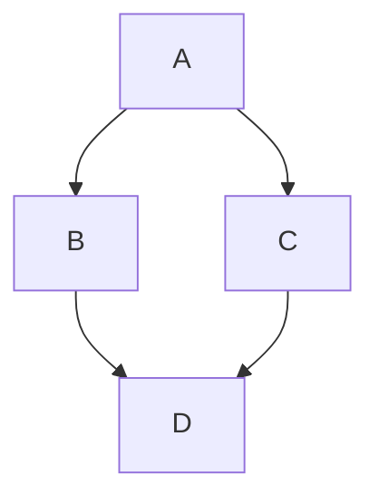
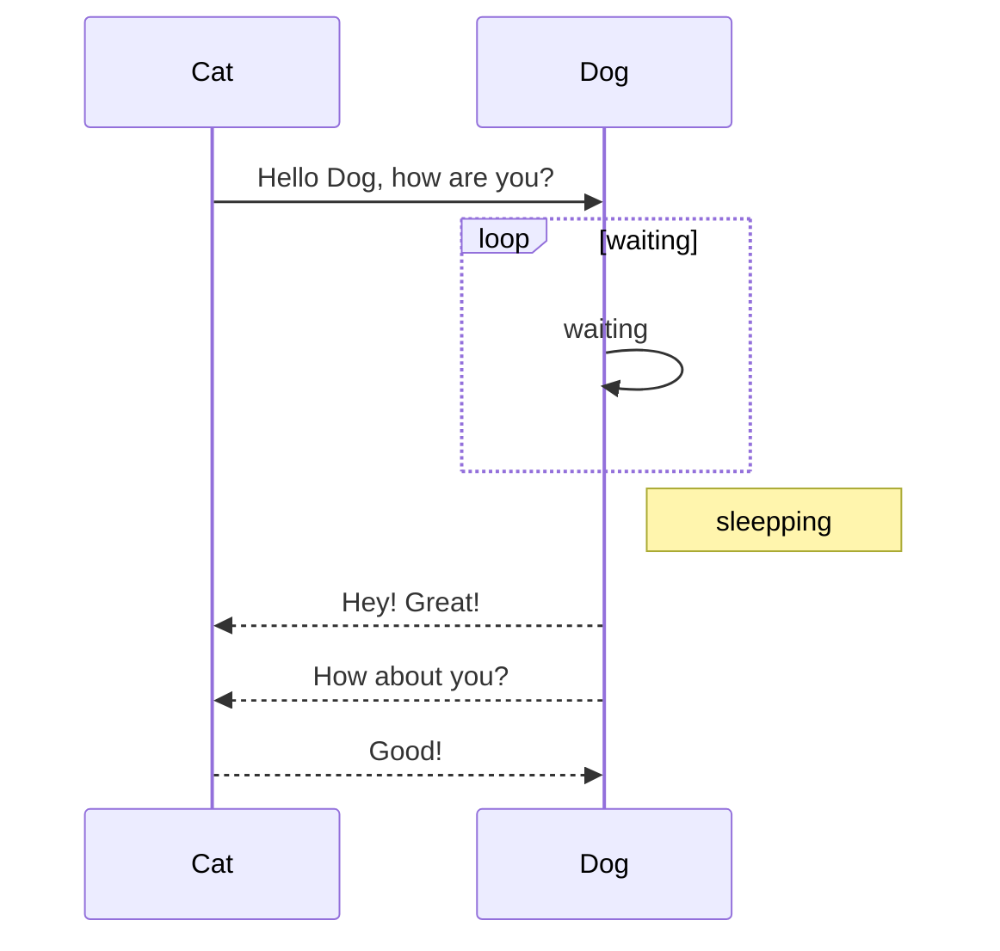
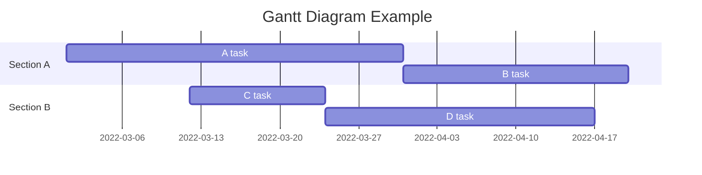
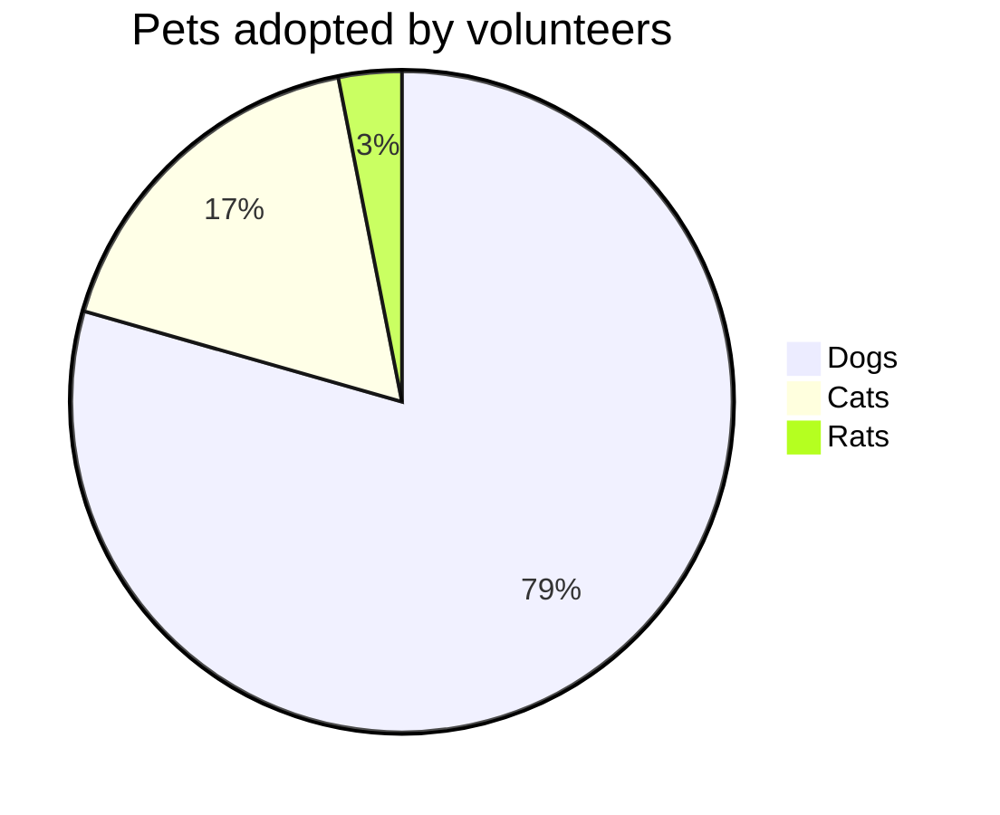
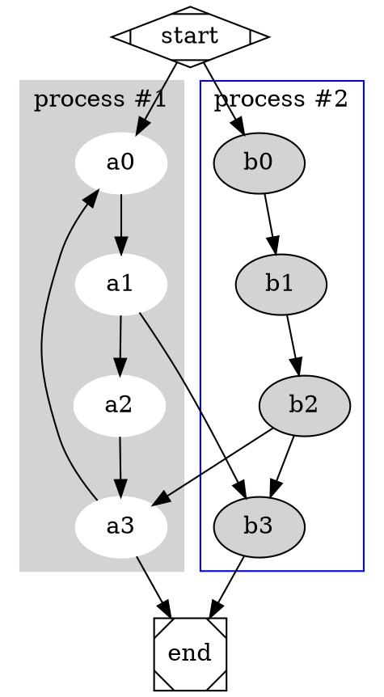

# MarkText

[TOC]

## Overview

**MarkText** is a markdown text editor for iPhone/iPad, supports GFM (GitHub Flavored Markdown) .

Features:

- Syntax highlight.
- HTML preview.
- Share to other Apps.
- Export as HTML/PNG/PDF.
- Category by _#Hashtag_ and _@Metion_.
- Swipe left to delete note, long press to rename.
- Local first, Sync via iCloud. Check your files in iCloud Drive.
- Keyboard toolbar: quick input, swipe to move cursor, pinch to select text.

## Markdown Syntax

### Images

``


### Headers

Add 1 ~ 6 `#` symbols before your heading text.

```
# This is H1
###### This is H6
```

### Strong and Emphasize 

`**strong**`, **strong**

`*emphasize*`, *emphasize*

`~~Strikethrough~~`, ~~Strikethrough~~ (GFM)

### Quotes

You can quote text with a `>`.

> Right angle brackets &gt; are used for block quotes.

### Link

Email: <xappbox@gmail.com>.  
Simple link: <http://lessfun.com/app>.  
Simple link: [Lessfun Blog](http://blog.lessfun.com/).  

Reference Link: [reference][id], Input id, then define the link with corresponding id, title in the link is optional:

[id]: http://lessfun.com/app/marktext/ "Markdown text editor for iOS"

#### Inline code

Inline code: surround by `backtick` key. 

#### Block code

	Indent each line by at least 1 tab, or 4 spaces.
    int var = 100; 

#### Fenced Code Blocks (GFM)

Start with a line containing 3 or more backticks, and ends with the first line with the same number of backticks:

```
Fenced code blocks are like Stardard Markdown’s regular code
blocks, except that they’re not indented and instead rely on
a start and end fence lines to delimit the code block.
```

Code with language name will have syntax hightlight:

``` cpp
std::string str = "hello world";
```

### Ordered Lists

Ordered lists are created using "1." + Space:

1. Ordered list item 1
2. Ordered list item 2

### Unordered Lists

Unordered list are created using `*` or `-` or `+` + `Space`:

- Unordered list item
- Unordered list item

### Task Lists (GFM)

You can create task lists by prefacing list items with [ ]. To mark a task as complete, use [x].

- [x] Completed task
- [ ] Uncompleted task

### Hard Linebreak

### End with two spaces

End a line with two or more spaces will create a hard linebreak, called `<br />` in HTML. ( Control + Return )  
Above line ended with 2 spaces.

### `Enter` equals line break (GFM)

Or you can just type Enter as a line break.

### Horizontal Rules

Three or more asterisks or dashes:

```
***
---
- - - -
```

---

## Extra Syntax

### Table of Content

Add `[toc]` or `[TOC]` at the top to generate the Table of Content. 

### Footnotes

Footnotes work mostly like reference-style links. A footnote is made of two things: a marker in the text that will become a superscript number; a footnote definition that will be placed in a list of footnotes at the end of the document. A footnote looks like this:

That's some text with a footnote.[^1]

[^1]: And that's the footnote.


### Tables (GFM)

A simple table looks like this:

Header 1 | Header 2 | Header 3
-------- | -------- | --------
  Cell   |   Cell   |   Cell
  Cell   |   Cell   |   Cell

If you wish, you can add a leading and tailing pipe to each line of the table:

| Header 1 | Header 2 | Header 3 |
| -------- | -------- | -------- |
|   Cell   |   Cell   |   Cell   |
|   Cell   |   Cell   |   Cell   |

Specify alignment for each column by adding colons to separator lines:

Header 1 | Header 2 | Header 3
:------- | :------: | --------:
Left     | Center   | Right
Left     | Center   | Right

### Graph Visualization

#### Mermaid

Please refer to [mermaid project](https://github.com/knsv/mermaid) for details.

##### Flow Chart



##### Sequence Diagram



##### Gantt



##### Pie



#### Graphviz

Please refer to [Graphviz website](http://www.graphviz.org/Home.php) for details.



### MathJax

Start with and end with `$` or `$$`.

`$\sum_{i=0}^N\int_{a}^{b}g(t,i)\text{d}t$`:

$\sum_{i=0}^N\int_{a}^{b}g(t,i)\text{d}t$

`$$W_G^{mn}=max\{0,W_G.\xi_G(f_G^m,f_G^n)\}$$`:

$$W_G^{mn}=max\{0,W_G.\xi_G(f_G^m,f_G^n)\}$$ 

## More

For compelete syntax, see [Markdown: Syntax](http://daringfireball.net/projects/markdown/syntax).
