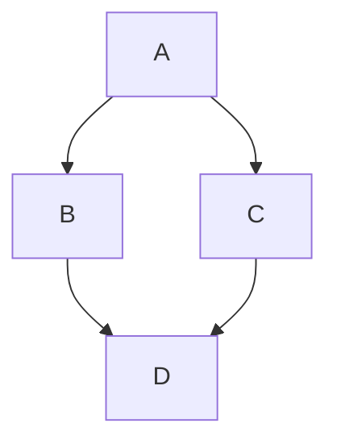
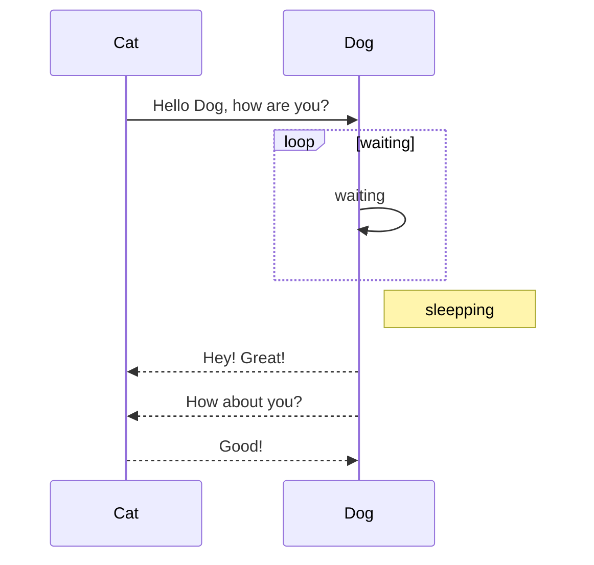
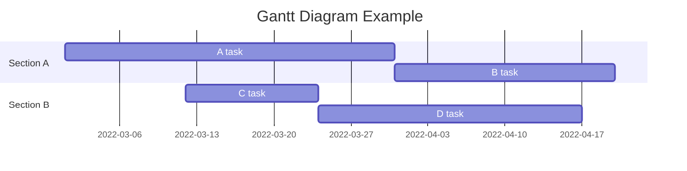
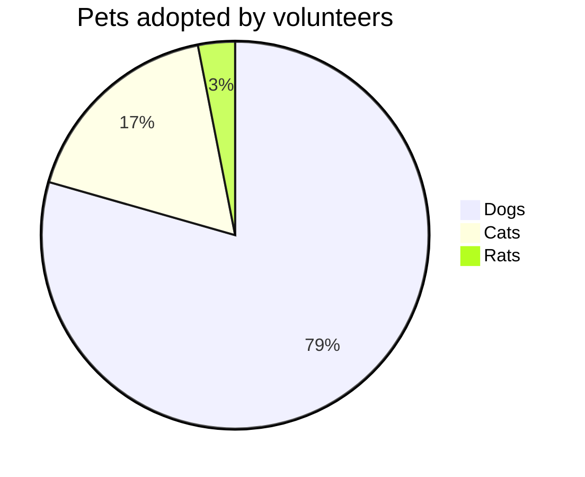
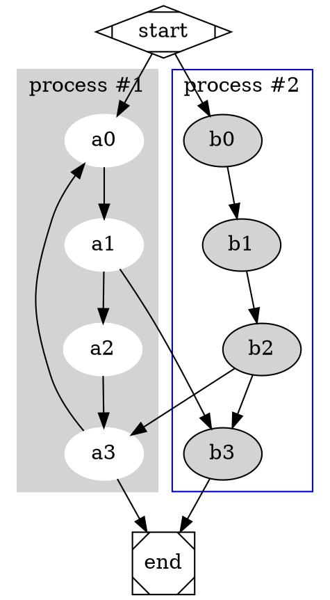

# MarkText

## 概述

**MarkText** 是 iPhone/iPad 上的一款 Markdown 编辑器，支持GFM (GitHub Flavored Markdown) 。

特性：

- 实时语法高亮，代码块高亮。
- HTML 预览，支持多种样式。
- 导出为 HTML/PNG/PDF。
- 分享到其他应用。
- 在笔记列表向左滑动可删除笔记，长按可重命名。
- 用 _#Hashtag_ 和 _@Metion_ 创建标签和分类。
- 本地优先，支持 iCloud 同步，可在 iCloud Drive 中查看。
- 键盘辅助工具栏：点击快速输入，左右滑动移动光标，捏合选择文字。

## 语法

### 图片

``


### 标题

1 ~ 6 个 `#` 号加空格开头：

```
# 这是 H1
###### 这是 H6
```

### 字体

`**加粗**`, **加粗**

`*强调*`, *强调*

`~~删除线~~`, ~~删除线~~

### 引用

右尖括号`>`开头，引用一段话：

> 右尖括号 &gt; 表示引用。

### 链接

邮箱: <xappbox@gmail.com>.  
链接: <http://lessfun.com/app>.  
链接: [Lessfun Blog](http://blog.lessfun.com/).  

引用样式的链接: [引用][id], 输入id，然后在文档内任意处定义该id所指向的地址，标题是可选的：

[id]: http://lessfun.com/app/marktext/ "Markdown text editor for iOS"

### 代码

#### 内嵌代码

用两个`反引号`键包围起来。  

#### 代码块

	每一行以一个Tab键、或者4个空格缩进。
    int var = 100; 


#### 固定的代码块

以三个`反引号`开始一行，并且以同数量的`反引号`结束一行，中间的内容就是固定的代码块。

```
NSString *str = @"Hello Markdown";
```

### 有序列表

有序列表以 "数字." + "空格"开始：

1. 选项1
2. 选项2

### 无序列表

无序列表以 `*` 或 `-` 或 `+` + `空格`开始：

- 选项1
- 选项2

### 任务列表

可以在有序列表或无序列表的基础上，加上 `[ ]` 创建任务列表；如果任务已完成，用 `[x]` 或 `[X]`。

- [x] 任务1
- [ ] 任务2

### 强制换行

在行末输入两个空格，会被转换成HTML的 `<br />` 标志。  

### 水平分割线

三个以上的星号或破折号：

```
***
---
- - - -
```

---

## 扩展语法

### 文档目录

在文档顶部输入 `[toc]` 或 `[TOC]` 即可生成文档目录.

### 脚注

脚注类似于引用样式的链接。脚注用于完成两件事：标志的文本会变成上标符号；脚注定义将被放置在一个文档末尾的列表。一个脚注看起来是这样的：

这是包含脚注的文本。[^1]

[^1]: 这是脚注内容。

### 表格

简单的表格：

Header 1 | Header 2 | Header 3
-------- | -------- | --------
  Cell   |   Cell   |   Cell
  Cell   |   Cell   |   Cell

也可以在首、尾加上分割线：

| Header 1 | Header 2 | Header 3 |
| -------- | -------- | -------- |
|   Cell   |   Cell   |   Cell   |
|   Cell   |   Cell   |   Cell   |

通过冒号来决定单元格内容的对齐方式：

Header 1 | Header 2 | Header 3
:------- | :------: | -------:
左       | 中        | 右
左       | 中        | 右

### 图表

#### Mermaid

[mermaid 官方文档](https://github.com/knsv/mermaid).

##### 流程图



##### 时序图



##### 甘特图



##### 饼状图



#### Graphviz

[Graphviz 官方文档](http://www.graphviz.org/Home.php).



### 数学公式

以 `$` 或 `$$` 开头和结尾。

`$\sum_{i=0}^N\int_{a}^{b}g(t,i)\text{d}t$`:

$\sum_{i=0}^N\int_{a}^{b}g(t,i)\text{d}t$

`$$W_G^{mn}=max\{0,W_G.\xi_G(f_G^m,f_G^n)\}$$`:

$$W_G^{mn}=max\{0,W_G.\xi_G(f_G^m,f_G^n)\}$$ 

## 更多

完整的 Markdown 语法，请查看：[Markdown: Syntax](http://daringfireball.net/projects/markdown/syntax).
